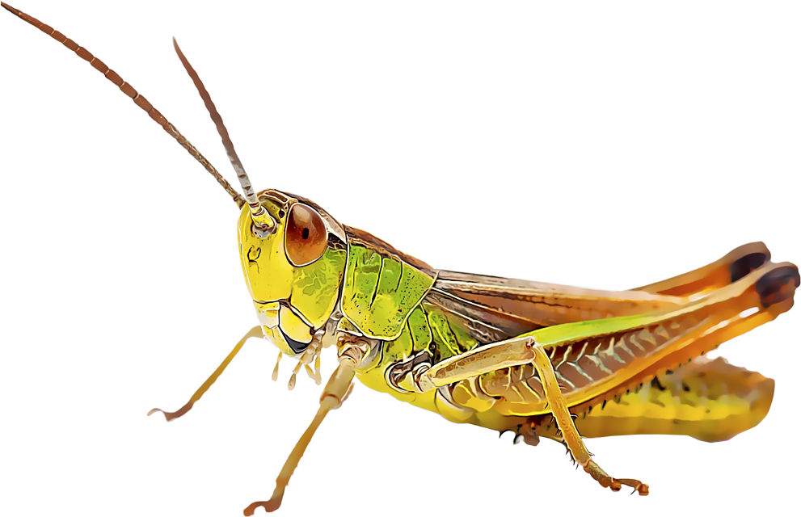
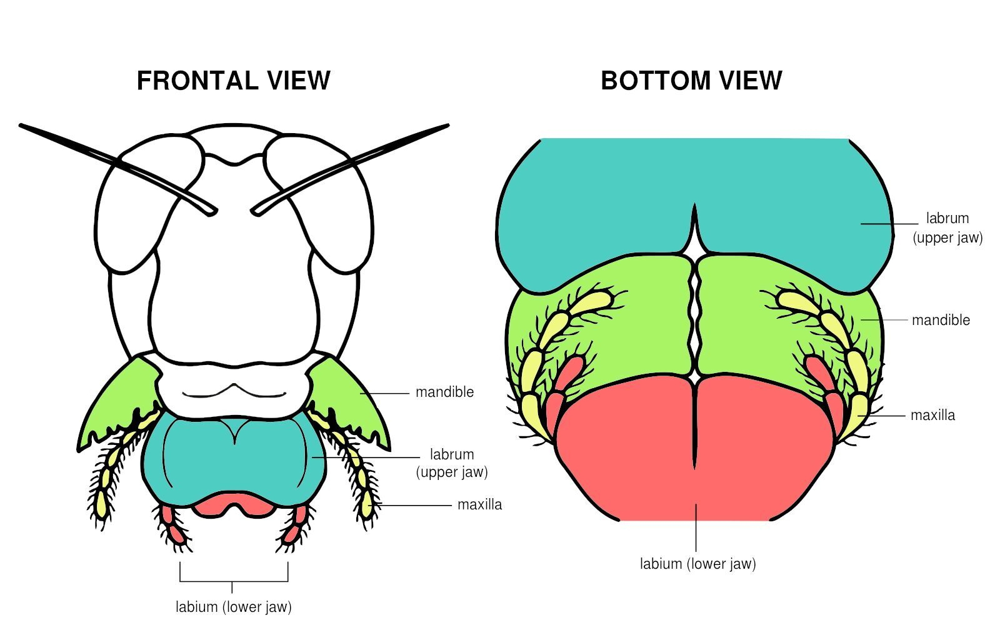

## Grasshopper

[Advanced Tab Manager For Firefox](https://addons.mozilla.org/en-US/firefox/addon/grasshopper-urls/)

Programmed by [madprops](https://github.com/madprops)

Lots of ideas by [N3C2L](https://github.com/N3C2L)

---

Grasshoppers are a group of insects belonging to the suborder Caelifera. They are among what is possibly the most ancient living group of chewing herbivorous insects, dating back to the early Triassic around 250 million years ago.

Grasshoppers are typically ground-dwelling insects with powerful hind legs which allow them to escape from threats by leaping vigorously. Their front leg is shorter and used for grasping food. As hemimetabolous insects, they do not undergo complete metamorphosis; they hatch from an egg into a nymph or "hopper" which undergoes five moults, becoming more similar to the adult insect at each developmental stage. The grasshopper hears through the tympanal organ which can be found in the first segment of the abdomen attached to the thorax; while its sense of vision is in the compound eyes, the change in light intensity is perceived in the simple eyes (ocelli). At high population densities and under certain environmental conditions, some grasshopper species can change color and behavior and form swarms. Under these circumstances, they are known as locusts.

Grasshoppers are plant-eaters, with a few species at times becoming serious pests of cereals, vegetables and pasture, especially when they swarm in the millions as locusts and destroy crops over wide areas. They protect themselves from predators by camouflage; when detected, many species attempt to startle the predator with a brilliantly coloured wing flash while jumping and (if adult) launching themselves into the air, usually flying for only a short distance. Other species such as the rainbow grasshopper have warning coloration which deters predators. Grasshoppers are affected by parasites and various diseases, and many predatory creatures feed on both nymphs and adults. The eggs are subject to attack by parasitoids and predators. Grasshoppers are diurnal insects—meaning, they are most active during the day time.

Grasshoppers have had a long relationship with humans. Swarms of locusts can have devastating effects and cause famine, having done so since Biblical times. Even in smaller numbers, the insects can be serious pests. They are used as food in countries such as Mexico and Indonesia. They feature in art, symbolism and literature. The study of grasshopper species is called acridology.

### Reviews

>Now I don’t know if other people think this, but I’m the only one that I know that is terrified of grasshoppers. Their body looks like a demon out of hell and the way they can swarm and decimate crops is terrifying. I can just imagine them going piranha mode on a live human. They make me shake and I can’t talk when I see them too close.

>They're pretty heavy too, so when they go all Kamikaze into my legs or face it makes a pretty noticeable thud, which always totally catches me off guard.

>I had to dissect one in biology. Hated every minute of it.

>I concur! Years ago we were riding quads and unknowingly drove right into an area with thousands of them. They were all over us! I was freaking out and the friend I was riding with knew how afraid of them I was and couldn’t stop laughing to get us out of there. I almost killed him.